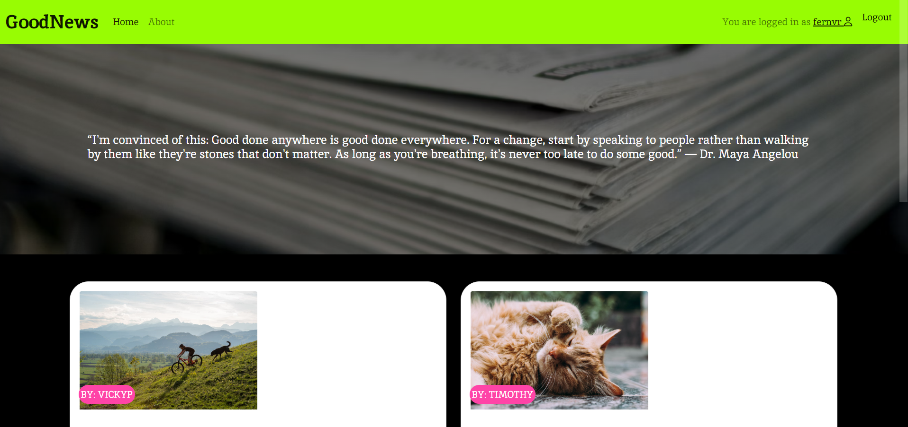
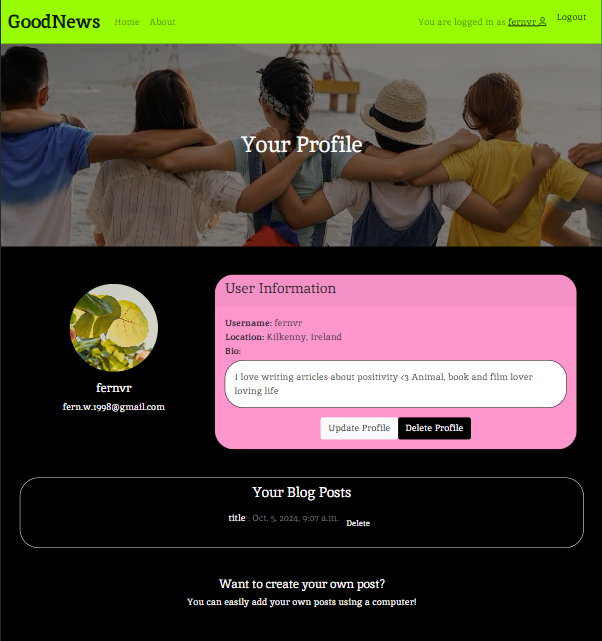

# Good News Blog

[Good News Blog - Deployed Link](https://goodnewsblog-b3d97592edc2.herokuapp.com/)

Welcome to GoodNewsBlog, a website dedicated to spreading positivity by sharing uplifting and feel-good news stories from around the world. Our platform is designed to highlight the good in humanity, showcasing inspiring acts of kindness, success stories, heartwarming events, and everyday heroes. Whether it’s stories about communities coming together, individuals making a difference, or milestones worth celebrating, GoodNewsBlog aims to be your go-to source for optimism and encouragement. We believe that positive news has the power to uplift, motivate, and remind us of the brighter side of life. Join us in making the world a little bit better, one story at a time!

## Contents

* [Good News Blog](#good-news-blog)

* [Website Goals and Objectives](#website-goals-and-objectives)

* [Target Audience](#target-audience)

* [Agile Methodology](#agile-methodology)
  - [Overview](#overview)
  - [Epics](#epics)
  - [GitHub Projects](#github-projects)
  - [User Stories](#user-stories)
  - [Developer Stories](#developer-stories)
  - [Visitor Stories](#visitor-stories)
  - [Registered User Stories](#registered-user-stories)
  - [Admin User Stories](#admin-user-stories)

* [Wireframes](#wireframes)

* [Database Schema](#database-schema)

* [Design and Layout](#design-and-layout)
  - [Typography](#typography)
  - [Colour Scheme](#colour-scheme)
  - [Images](#images)
  - [Responsiveness](#responsiveness)

* [Features](#features)
  - [Existing Features](#existing-features)
  - [Future Features](#future-features)
  - [Issues and Bugs](#issues-and-bugs)
    - [Resolved Bugs](#resolved-bugs)
    - [Unresolved Bugs](#unresolved-bugs)

* [Testing](#testing)

* [Technologies Used](#technologies-used)
  - [Frameworks]()

* [Deployment](#deployment)
  * [Heroku]()

* [Credits](#credits)
  - [Media]()

* [Acknowledgements](#acknowledgements)

## Website Goals and Objectives
The primary goal of GoodNewsBlog is to create a space where people can find positive, heartwarming stories that uplift their spirits and inspire hope. Our specific objectives are:

1. **Promote Positivity**: We aim to counterbalance the often negative tone of mainstream media by providing a consistent stream of encouraging and feel-good news stories that highlight the goodness in people and the world around us.

2. **Inspire Action:** By showcasing stories of kindness, bravery, and innovation, we hope to inspire our readers to take positive action in their own lives and communities, fostering a ripple effect of good deeds and meaningful change.

3. **Build a Community:** We seek to create an engaged community where readers can share their own stories of hope and positivity, interact with others, and feel connected through shared values of compassion and optimism.

4. **Create a Global Impact:** By sharing stories from diverse cultures and regions, we aim to emphasize our global interconnectedness and remind readers that positivity and kindness exist in every corner of the world.

5. **Support Mental Well-Being:** In a world often filled with anxiety-inducing news, we strive to be a source of emotional relief and encouragement, contributing to a more balanced and mentally healthy media consumption.

GoodNewsBlog is committed to shining a light on the good, helping people feel inspired and more optimistic about the future.

## Target Audience
The target audience of GoodNewsBlog includes individuals of all ages who seek a break from negative news and are looking for uplifting, positive stories. Our readers are people who value kindness, optimism, and community, and they range from young adults to older generations who enjoy feel-good content. This includes:

- **Optimistic Readers:** Those who enjoy stories that inspire hope and positive change.

- **Mental Health Advocates:** People seeking content that supports emotional well-being and reduces stress.

- **Community-Oriented Individuals:** Readers interested in stories about charity, local heroes, and global kindness.

- **Families and Educators:** Individuals looking for family-friendly, motivational content to share with children and students.

Overall, GoodNewsBlog appeals to anyone who wants to focus on the brighter side of life and find encouragement in everyday acts of goodness.

## Agile Methodology
### Overview
In the GoodNewsBlog development stages, the Agile methodology was used to manage development through iterative and incremental progress. Key features like the comment section, profile updates, and post interactions were implemented in short sprints, allowing for continuous improvement and feedback. Each iteration focused on adding specific functionalities, such as enabling users to post blogs or add comments, ensuring that the project evolved incrementally. Collaboration, regular feedback, and adaptability were prioritized, ensuring that the project could be adjusted based on user needs and technical requirements as it progressed.

### GitHub Projects
I created 5 seperate GitHub project boards for this project, one to represent each iteration. Each project includes issues for each iteration, with all tasks attached to the issue, so I could check off the task boxes when completing a new task.

##### Iteration 1 

##### Iteration 2

##### Iteration 3

##### Iteration 4

##### Iteration 5 

### Epics
The epics/iterations for this project were divided into stages of development, trying to prioritise the most important tasks first and leaving the testing and validation for the final iteration. I tried my best to keep the most relevant user stories grouped together when planning the iterations and I included a brief description of each epic on my projects. (link projects page)

#### Iteration 1 :
Create core functionality, superuser, and administrator tasks.
[Link to full Kanban Board with all issues included in this Iteration](https://github.com/users/FernVR/projects/2)

#### Iteration 2 :
Create register, login, logout functionality with basic structure added to HTML Templates.
[Link to full Kanban Board with all issues included in this Iteration](https://github.com/users/FernVR/projects/3)

#### Iteration 3 :
Creating basic functionality on home page, blog posts page and about page. (Comments, add posts, likes, forms).
[Link to full Kanban Board with all issues included in this Iteration](https://github.com/users/FernVR/projects/4)

#### Iteration 4 :
Style/polish all views.
[Link to full Kanban Board with all issues included in this Iteration](https://github.com/users/FernVR/projects/5)

#### Iteration 5 :
All Manual and Automated Testing tasks/issues for Good News Blog and all documentation tasks.
[Link to full Kanban Board with all issues included in this Iteration](https://github.com/users/FernVR/projects/6/views/1)

### User Stories
The issues/ user stories were broken down into different categories, developer, visitor, registered-user and admin user stories. This was to separate concerns and ensure that all user functionality was being added. I added personalised labels to the issues so I could see which categories each issue was separated into, and how many from each section I was still working on to complete. 

### Developer Stories
Some examples of developer stories used in GoodNewsBlog:

- As a **developer** I can **enable users to be authenticated using Django All Auth** so that **I can guarantee safe authentication across site platforms.**

- As a **developer** I can **enable error handling** so that **I can evade any crashes or bugs on the site.**

- As a **developer** I can **create different html templates using DTL** so that **save time coding html and create greater efficiency.**

*You can access **all** developer stories for this project by redirecting to the issues tab of this repo*

[GoodNewsBlog- Issues](https://github.com/FernVR/GoodNewsBlog/issues)

### Visitor Stories
Some examples of visitor stories used in GoodNewsBlog:

- As a **visitor** I can **view a list of posts on the home page** so that **I can select which post I want to view.**

- As a **visitor** I can **sign up** so that **I can access features for registered users.**

- As a **visitor** I can **access the about page** so that **find out more information about the site, and maybe provide feedback.**

*You can access **all** visitor stories for this project by redirecting to the issues tab of this repo*

[GoodNewsBlog- Issues](https://github.com/FernVR/GoodNewsBlog/issues)

### Registered User Stories
Some examples of registered-user stories used in GoodNewsBlog:

- As a **registered user,** I can **create my own posts to be published,** so that **I can positively interact with the site and other site users.**

- As a **registered user** I can **add comments to any blog posts** so that **communicate more with the site and other members of the online community.**

- As a **registered user** I can **log into website using my registered credentials** so that **access all features on the site.**

*You can access **all** registered-user stories for this project by redirecting to the issues tab of this repo*

[GoodNewsBlog- Issues](https://github.com/FernVR/GoodNewsBlog/issues)

### Admin User Stories
Some examples of admin user stories used in GoodNewsBlog:

- As a **site admin** I can **create, read, update and delete posts** so that **I can manage my blog content.**

- As a **site administrator** I can **add and access all comments on the admin page** so that **maintain control over user interactions on the site.**

- As a **site administrator** I can **have special credentials** so that **I can only access all information on the site.**

*You can access **all** admin-user stories for this project by redirecting to the issues tab of this repo*

[GoodNewsBlog- Issues](https://github.com/FernVR/GoodNewsBlog/issues)

## Wireframes
I used Figma to create basic wireframes for standard screensizes:

Home Page

Contact

Post Detail

Comments

Add Post

Sign Up/Sign In

## Database Schema
I used Lucid Chart to create basic Entity Relationship Diagrams for database schema:
- Note : I ended up deleting like model, view and urls because it was causing errors I couldn't fix, like model is included in ERD for future features purposes.

## Design and Layout
### Typography

Inika Font is a serif typeface designed with elegance and readability in mind. Its soft, well-balanced letterforms make it ideal for both print and digital platforms. I decided to use this font for:
- Readability: The serif design enhances legibility, especially in longer articles, making it perfect for news content.
- Professional Aesthetic: Inika has a formal yet approachable look, adding credibility to journalistic content.
- Versatility: It works well on various screen sizes, providing a consistent reading experience on mobile and desktop.
- Distinctive Style: Its unique design helps a news blog stand out while maintaining a polished appearance.
### Colour Scheme

### Images
I tried to carefully select the images to match the overall theme and aesthetic of the site. I tried to use complimenting colours where possible.

Home Page Banner

About Page Banner

Profile Page

### Responsiveness
Website is response across all device screen sizes :

Home Page Mobile

Home Page Tablet

Home Page Desktop

Profile Page Mobile

Profile Page Tablet

Profile Page Laptop

- More responsive testing grids included within [TESTING.md](TESTING.md)

## Features
### Existing Features
#### Home Page 
- Registered users and visitors can access the blog post list on the home page, can access links on the navigation and footer sections.

Navigtion- Logged Out

Navigtion- Logged In

Footer

Post List

#### Post Detail
- Users can view full articles and read comments, registered users can add comments, edit and delete the comments they have added.

Full Article

Comments

Add Comment

Edit Comment

Delete Comment

#### About Page 
- Visitors can read about the site's goals and objectives on the about page, they can also submit a feedback form if they wish.

Content

Contact Form

#### Register/Login/Logout Page
- Visitors can register as a new user, registered users can log in and log out to keep their accounts safe.

Register New User

Sign In

Sign Out

#### User Profile Page
- Registered users can access their profile page to add or manage their blog posts. Users can also update or delete their profile information if they wish.

User Profile Page

Add Post Form

Update Profile Form

Delete User Profile

### Future Features
#### Likes 
- I attempted to create a like feature for this project but found myself running out of time before being able to fix the errors it was causing. I thought it was working ok until I tried to call the like/dislike buttons and caused a 500 error. Had I given myself a bit more time I would have definitely wanted to fix this issue and include it here. Would like to add this feature later in development.

#### Drafts / Edit Posts
- I have included a post list section of the user profile, so users can access and delete their added posts, but would later like to include an option for a user to be able to edit their posts too, whether they are approved or unnapproved.

#### Small/Medium text field for 'add user post' section
- I had an issue with using the summernote text editor as my content field for the add post section, the editor was too large for small/medium screens and was greatly pushing the content off the screen. I couldn't find a way to change the size of the editor/ include a different editor for smaller screens, but I would like to find a way to include this feature on small screens so the feature can be accessed by users on any device. ( This bug is recorded in the bug section of my Testing file, [TESTING.md](TESTING.md) )

### Issues and Bugs 
#### Resolved Bugs 
* All bug-related documentation can be found within [TESTING.md](TESTING.md)
* All recorded resolved bugs can also be found within [Github Issues](https://github.com/FernVR/GoodNewsBlog/issues?q=is%3Aissue+is%3Aclosed+label%3Abug)
#### Unresolved Bugs
* All bug-related documentation can be found within [TESTING.md](TESTING.md)
* All recorded resolved bugs can also be found within [Github Issues](https://github.com/FernVR/GoodNewsBlog/issues?q=is%3Aissue+is%3Aclosed+label%3Abug)

## Testing
* All testing documentation can be found within [TESTING.md](TESTING.md)

## Technologies Used
### Languages Used

* [Python](https://www.python.org/doc/)
* [Django](https://www.djangoproject.com/)
* [Javascript](https://en.wikipedia.org/wiki/JavaScript)
* [CSS](https://en.wikipedia.org/wiki/CSS)
* [HTML](https://en.wikipedia.org/wiki/HTML)

### Frameworks, Libraries & Programs Used

1. [Visual Studio Code](https://code.visualstudio.com/)
    - I used Visual Studio Code as editor for this project.

1. [GitPod:](https://www.gitpod.io/)
    - I used GitPod as my editor for this project.

1. [Git](https://git-scm.com/)
    - Git was used for version control by utilizing the Gitpod terminal to commit to Git and Push to GitHub.

1. [GitHub:](https://github.com/)
    - GitHub is used to store the projects code after being pushed from Git.

1. [Django:](https://www.djangoproject.com/)
    - I used Django as the python framework.

1. [Bootstrap:](https://getbootstrap.com/)
    - I used Boostrap as the HTML/CSS framwork.

1. [Python Tutor Visual Debugger:](https://pythontutor.com/)
    - I sometimes used Python Tutor for debugging.

1. [Heroku:](https://heroku.com)
    - For final deoployment.

1. [Notes:](https://apple.com/notes/)
    - I used the apple notes app on both my iPad and my iPhone for sketches, or any other planning/checklists used for this project.

1. [Lucid Charts:](https://apple.com/notes/)
    - I used Lucid Charts to create a database schema for GoodNewsBlog.

1. [Figma:](https://www.figma.com/)
    - I used Figma to create wireframes for this project.

1. [Favicon Generator](https://favicon.io/favicon-generator/)
    - I used Favicon generator to generate the favicon icon in the browser for free.

1. [Apple Numbers:](https://apple.com/numbers/)
    - I used the Numbers app on my iPad pro to create testing spreadsheets.

## Deployment
### Github
1. Login (or sign up) to Github.
2. Find the repository for this project, Code-Institute-Projekt-3-PYTHON-battleship.
3. Click on the Settings link.
4. Click on the Pages link in the left-hand side navigation bar.
5. In the Source section, choose main from the drop-down select branch menu. Select Root from the drop-down select folder menu.
6. Click Save. Your live Github Pages site is now deployed at the URL shown.cal machine.

### Heroku

The deployment is made using [Heroku](https://www.heroku.com/) following the listed steps:

1. Log in or register a new account on Heroku
2. Click on 'New' in the dashboard and select 'Create New App'
3. Select a name for the app and choose your region.
4. Click on "Create app"
5. When the app is created click on Setting
6. To improve compatibility with various Python libraries add Config Var with Key = PORT and the Value = 8000
7. Add 2 buildpacks: Python and then Nodejs in this specific order 
8. Go back at the top and click on "Deploy" and select "GitHub"
9. Scroll down and click on 'Connect to GitHub'
10. Search for your GitHub repository name by typing it
11. Click on "Connect"
12. Scroll down and click on "Deploy Branch"
13. You will see a message "The app was successfully deployed" when the app is built with python and all the depencencies
14. Click on view and you will see the deployed site

#### How to Clone

1. Login (or sign up) to GitHub.
2. Go to the repository for this project, it can be found here (link)
3. Click on the code button, select whether you would like to clone with HTTPS, SSH, or GitHub CLI, and copy the link shown.
4. Open the terminal in your code editor and change the current working directory to the location you want to use for the cloned directory.
5. Type 'git clone' into the terminal and then paste the link you copied in step 3. Press enter.

## Credits 
### Code
* I took a lot of my inspiration for this project from the CI PP4 Walkthrough project that was also a blog. I used some of the models and view functions to create a basic structure and plan for my own functions, though I added a lot of different functionality.

* I took some inspiration from these youtube channels, as well as this documentation to help me learn django and implement different features:
    - [Codemy.com](https://www.youtube.com/watch?v=B40bteAMM_M&list=PLCC34OHNcOtr025c1kHSPrnP18YPB-NFi)
    - [Tech With Tim](https://www.youtube.com/watch?v=nGIg40xs9e4)
    - [Python Simplified](https://www.youtube.com/watch?v=EEiqGjCNLRs)
    - [Medium.com](https://medium.com/@singhgautam7/django-annotations-steroids-to-your-querysets-766231f0823a)
    - [Treehouse.com](https://teamtreehouse.com/)

### Content
* I used some news articles from these websites:
    - [The Good News Hub](https://thegoodnewshub.com/)
    - [NPR](https://www.npr.org/)

### Media 
* All banner images, post featured images and user profile photos were taken from [Unsplash](https://unsplash.com) :
    - [Duck Img - placeholder](https://unsplash.com/photos/a-duck-standing-on-top-of-a-rock-next-to-a-body-of-water-ys1F9ntKRfA)
    - [Bike Img - article](https://unsplash.com/photos/a-man-riding-a-bike-next-to-a-dog-on-a-lush-green-hillside-pNsBOpod-tI)
    - [Cat Img - article](https://unsplash.com/photos/orange-persian-cat-sleeping-9UUoGaaHtNE)
    - [Jungle Img - article](https://unsplash.com/photos/a-leopard-in-the-middle-of-a-jungle-DSaL_3YwLu8)
    - [Windmill Img - article](https://unsplash.com/photos/windmill-on-grass-field-during-golden-hour-0w-uTa0Xz7w)
    - [Dogs Img - article](https://unsplash.com/photos/black-short-coated-dog-in-blue-and-brown-wooden-box-nbxffbJKPYc)
    - [Leaves Img - article/profile img](https://unsplash.com/photos/yellow-and-green-leaves-during-daytime-CtLx4qCdhf8)
    - [Water Img - article](https://unsplash.com/photos/rocks-on-sea-bed-U6dnImauDAE)
    - [Birds Img - article](https://unsplash.com/photos/two-small-birds-perched-on-a-twig-KLylpBvo0ww)
    - [Dog img - article](https://unsplash.com/photos/shallow-focus-photography-of-white-shih-tzu-puppy-running-on-the-grass-qO-PIF84Vxg)
    - [Friends img - Profile Banner](https://unsplash.com/photos/people-holding-shoulders-sitting-on-wall-Cecb0_8Hx-o)
    - [Newspaper img - Home Banner](https://unsplash.com/photos/pile-of-newspapers-H6eaxcGNQbU)

## Acknowledgements
* Code Institute and its amazing Slack community for their support and providing me with the necessary knowledge to complete this project.

* My mentor Sandeep, for providing a lot of knowledge, guidance and very helpful reading materials.

[Back To Top](#good-news-blog)