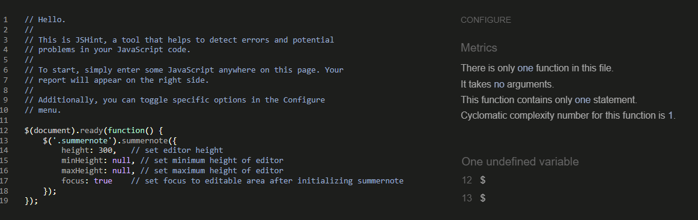
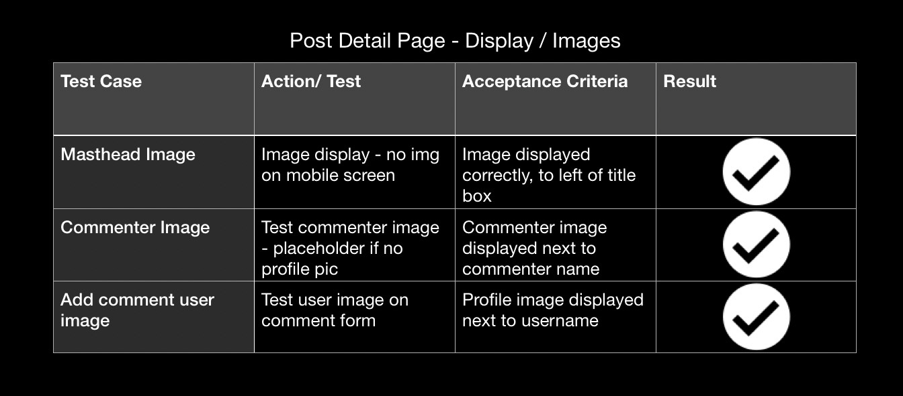
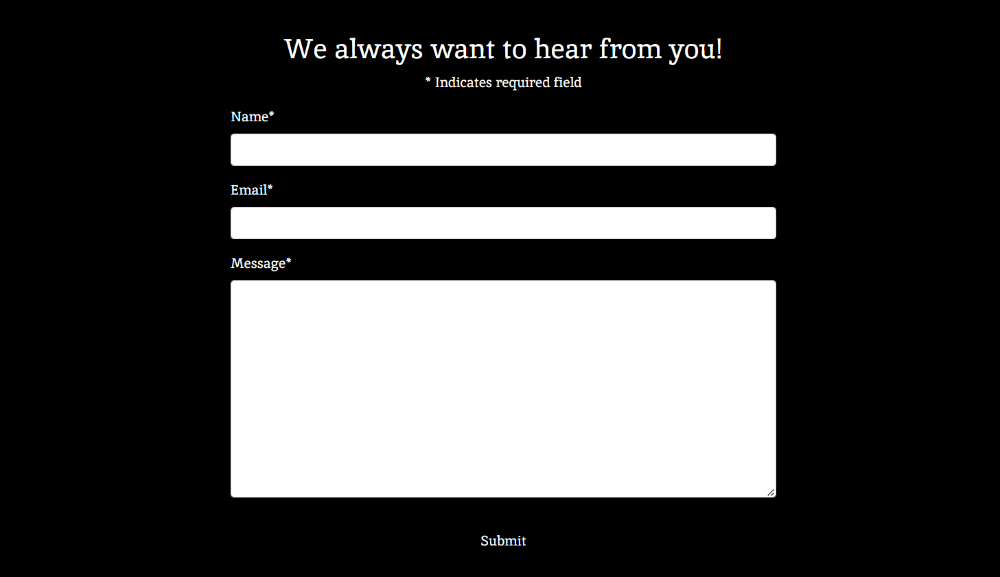
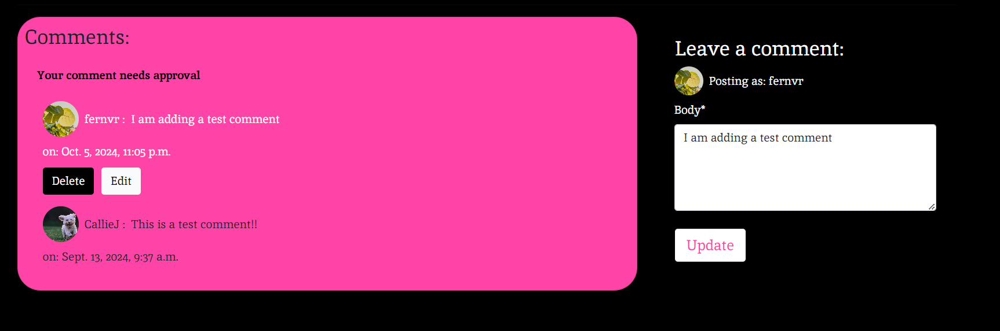

# Testing 
Back to [README.md](README.md) file.

# Contents 
- [Code Validation](#code-validation)
    - [HTML](#html)
    - [CSS](#css)
    - [Javascript](#javascript)
    - [Python](#python)

- [Python Unit Testing](#python-unit-testing)

- [Automated Testing](#automated-testing)

- [Manual Testing](#manual-testing)
    - [Home Page](#home-page)
    - [About Page](#about-page)
    - [Profile Page](#profile-page)
    - [Sign up/ Sign In/ Sign Out Pages](#sign-up-sign-in-sign-out-pages)
    - [Update/ Delete Profile Page](#update-delete-profile-page)

- [User Story Testing](#user-story-testing)
    - [Developer User Stories](#developer-user-stories)
    - [Visitor User Stories](#visitor-user-stories)
    - [Registered User Stories](#resgistered-user-stories)
    - [Admin User Stories](#admin-user-stories)

- [UI](#ui)

- [Bugs](#bugs)

- [Browser Compatibility](#browser-compatibility)

- [Lighthouse Test Result](#lighthouse-test-result)

## Code Validation
### HTML 
I used [The W3C Markup Validation Service](https://validator.w3.org/) to validate all HTML pages by inputting the source code into the direct input field, these were my results:

| Page | Result | Notes | Result Screenshot |
| ------------ | ------------ | ------------ | ------------ |
| Home | Pass | No errors | 

Home

 |
| Post Detail | Pass | No errors | 

Post Detail

 |
| About | Pass | No errors | 

About

 |
| User Profile | Pass | The errors caused by SummerNote Widget. Removed Widget and tested, no errors were returned. | 

Profile Errors

Profile Errors 

Profile Errors

 |
| Update Profile | Pass | No errors | 

Profile Update

 |
| Delete Profile | Pass | No errors | 

Delete Profile

 |
| Register/Sign Up | Pass | Errors are are related to built in Django form template  | 

Sign Up Error

Sign Up

 |
| Sign In/Sign Out | Pass | No errors | 

Sign In

Sign Out

 |

### CSS
I used [The W3C CSS Validation Service](https://jigsaw.w3.org/css-validator/) to validate my style.css file, I got these results:

| Test | Result | Notes | Result Screenshot |
| ------------ | ------------ | ------------ | ------------ |
| style.css | Pass | Recieved 5 warnings (screenshot included) | 

Result

CSS Warnings

 |

### Javascript
I used [JSHint](https://jshint.com/) to validate my style.css file, I got these results:

| Test File | Result | Notes | Result Screenshot |
| ------------ | ------------ | ------------ | ------------ |
| comments.js | Pass | No errors - Warnings listed in screenshot | 

Comment Warnings

Comment Warnings

 |
| summernote-init.js | Pass | No errors - warnings listed in screenshot | 

Summernote Warnings

### Python
I used [The CI Python Linter](https://pep8ci.herokuapp.com/) to validate my python files, I got these results:

| Test File | Result | Notes | Result Screenshot |
| ------------ | ------------ | ------------ | ------------ |
| blog/views.py | Pass | No errors | 

blog/views.py

 |
| blog/urls.py | Pass | No errors | 

blog/urls.py

 |
| blog/test_views.py | Pass | No errors | 

blog/test_views.py

 |
| blog/test_forms.py | Pass | No errors | 

blog/test_forms.py

 |
| blog/forms.py | Pass | No errors | 

blog/forms.py

 |
| blog/models.py | Pass | No errors | 

blog/models.py

 |
| blog/apps.py | Pass | No errors | 

blog/apps.py

 |
| blog/admin.py | Pass | No errors | 

blog/admin.py

 |
| about/views.py | Pass | No errors | 

about/views.py

 |
| about/test_views.py | Pass | No errors | 

about/test_views.py

 |
| about/test_forms.py | Pass | No errors | 

about/test_forms.py

 |
| about/models.py | Pass | No errors | 

about/models.py

 |
| about/admin.py | Pass | No errors | 

about/admin.py

 |

## Python Unit Testing
Results for testing report can be found in [test_report.txt](test_report.txt) which I generated using the 'python manage.py test -v 2 > test_report.txt' command in the terminal.

Python Unittest Result
 

### Automated Testing
Testing functions can be found in these files:
[Blog/Test Forms](blog/test_forms.py)
[Blog/ Test Views](blog/test_views.py)
[About/ Test Forms](about/test_forms.py)
[About/ Test Views](about/test_views.py)

Automated testing
 

## Manual Testing
Extensive Manual Testing was carried out during the duration of this project. I tried to test each feature/link upon creating them, I have also included screenshots of the testing grids I created.
### Home Page

Links and Buttons 
 

Display and Images
 

Responsive Design Grid 
 

### Post Detail Page

Links and Buttons 
 

Display and Images
 

Responsive Design Grid 
 

### About Page

Links and Buttons 
 

Display and Images
 

Responsive Design Grid 
 

### Profile Page

Links and Buttons 
 

Display and Images
 

Responsive Design Grid 
 

### Sign Up/ Sign In/ Sign Out Pages

Links and Buttons 
 

* Display / Images : No images used on this section. Display has no errors.

Responsive Design Grid 
 

### Update/ Delete Profile Page

Links and Buttons 
 

* Display / Images : No images used on this section. Display has no errors.

Responsive Design Grid 
 

## User Story Testing

### Admin User Stories

| User Story | Acceptance Criteria Complete | Screenshot/Notes |
| ------------ | ------------ | ------------ | 
| [Managing Comments](https://github.com/FernVR/GoodNewsBlog/issues/9) | Pass | 

Comments Admin Page

 |
| [Managing Posts](https://github.com/FernVR/GoodNewsBlog/issues/6) | Pass | 

Posts Admin Page

 |

### Visitor User Stories

| User Story | Acceptance Criteria Complete | Screenshot/Notes |
| ------------ | ------------ | ------------ | 
| [Sign Up](https://github.com/FernVR/GoodNewsBlog/issues/12) | Pass | 

Sign Up Link

Sign Up Form

 |
| [Scroll Blog Posts](https://github.com/FernVR/GoodNewsBlog/issues/10) | Pass | 

Post List - Home Page

 |
| [View Blog Posts](https://github.com/FernVR/GoodNewsBlog/issues/23) | Pass | 

Post Detail Page

 |
| [Visit About Page](https://github.com/FernVR/GoodNewsBlog/issues/7) | Pass | 

About Page

Feedback Form

 - Includes Feedback form |
| [View Comments](https://github.com/FernVR/GoodNewsBlog/issues/45) | Pass | 

Comments- Logged Out

 |

### Resgistered User Stories

| User Story | Acceptance Criteria Complete | Screenshot/Notes |
| ------------ | ------------ | ------------ | 
| [User Profile Page](https://github.com/FernVR/GoodNewsBlog/issues/26) | Pass | 

Profile Page

 |
| [Adding Comments](https://github.com/FernVR/GoodNewsBlog/issues/17) | Pass | 

Add Comment Form

Edit Comment

Delete Comment

 |
| [User Add Posts](https://github.com/FernVR/GoodNewsBlog/issues/18) | Pass | 

Add Post Form

 | 
| [User Delete Profile](https://github.com/FernVR/GoodNewsBlog/issues/52) | Pass |

Update Profile Details

 

Delete Profile Message

 |

## Bugs

| Bug/Issue | Resolved/Unresolved | Notes |
| ------------ | ------------ | ------------ | 
| [About Page - Nav and Footer UI Issue](https://github.com/FernVR/GoodNewsBlog/issues/29) | Resolved | added boostrap styles to all sections to ensure no content pushes the nav and footer. |
| [Comment Count](https://github.com/FernVR/GoodNewsBlog/issues/28) | Resolved | Fixed using connotate and Q |
| [User/ Profile](https://github.com/FernVR/GoodNewsBlog/issues/43) | Resolved | added signals to create profile page when new user is created |
| [Text field on user post form](https://github.com/FernVR/GoodNewsBlog/issues/44) | Resolved | Added add post section only to users with larger screen resolutions - would like to include a small/medium size text field later, so feature is available to all users on different devices - documented in Future Features section of [README.md](README.md) |
| [Comment Section - responsive design](https://github.com/FernVR/GoodNewsBlog/issues/47) | Resolved/Partially | User information on comment section and comments are still not spaced correctly, larger comments squash too close together. This is because of the display flex on both of those sections, but I kept it as it was because it looks correct on medium/larger screens. 
| [User Profile Page - UI Issue](https://github.com/FernVR/GoodNewsBlog/issues/50) | Unresolved | 

Profile Page UI Bug
 
 Couldn't fix the push on nav and footer content after attempting to with adjusting all boostrap classes and styling on each section, I think the issue is coming from the post list section, but I can't figure out exactly. |
| [Contact app/Django Crispy Form](https://github.com/FernVR/GoodNewsBlog/issues/27) | Unresolved | I deleted the contact app as I was only going to use it for the form, I included the form within the About section instead. |
| [Bug: UI Problems - User Profile Page section](https://github.com/FernVR/GoodNewsBlog/issues/51) | Unresolved | Tried to fix this in lots of different ways and couldn't find a suitable solution in time.  | 

## Browser Compatibility

Browser Compatibility Grid 
 

## Lighthouse Test Result
 I generated a Google Lighthouse report and got this result:

 

 The score for Best Practises was a lot lower than I'd hoped, I tried to use the report to solve the issues but I wasn't able to find an adequate solution. I would definitely be trying to improve this score in future.

Lighthouse Best Practises 
 

