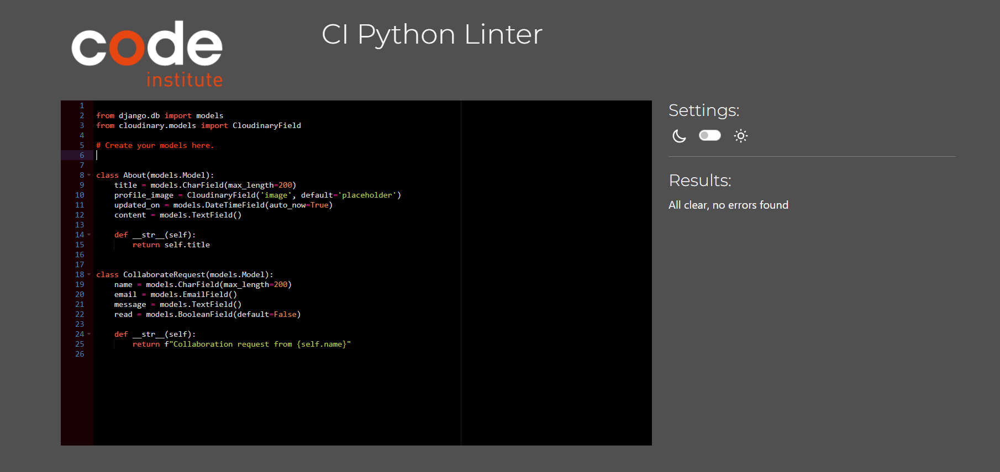
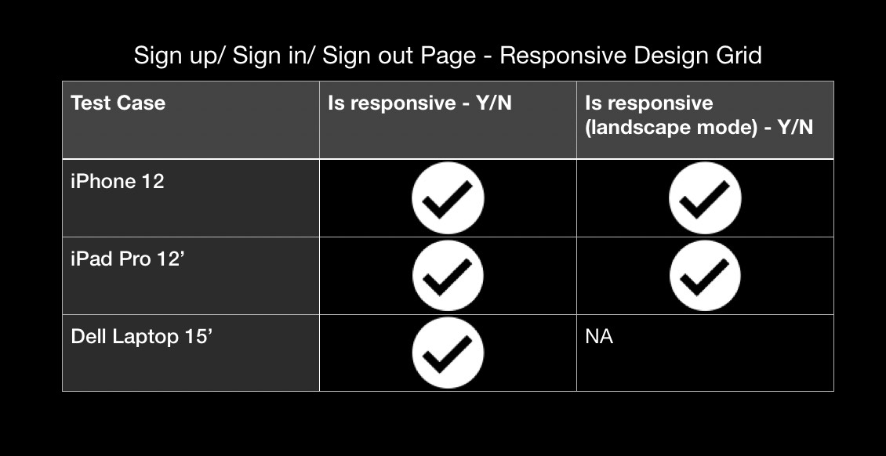

# Testing 
Back to [README.md](README.md) file.

# Contents 
- [Code Validation](#code-validation)
    - [HTML](#html)
    - [CSS](#css)
    - [Javascript](#javascript)
    - [Python](#python)

- [Python Unit Testing](#python-unit-testing)

- [Automated Testing](#automated-testing)

- [Manual Testing](#manual-testing)
    - [Home Page](#home-page)
    - [About Page](#about-page)
    - [Profile Page](#profile-page)
    - [Sign up/ Sign In/ Sign Out Pages](#sign-up-sign-in-sign-out-pages)
    - [Update/ Delete Profile Page](#update-delete-profile-page)

- [User Story Testing](#user-story-testing)
    - [Developer User Stories](#developer-user-stories)
    - [Visitor User Stories](#visitor-user-stories)
    - [Registered User Stories](#resgistered-user-stories)
    - [Admin User Stories](#admin-user-stories)

- [UI](#ui)

- [Bugs](#bugs)

- [Browser Compatibility](#browser-compatibility)

- [Lighthouse Test Result](#lighthouse-test-result)

## Code Validation
### HTML 
I used [The W3C Markup Validation Service](https://validator.w3.org/) to validate all HTML pages by inputting the source code into the direct input field, these were my results:

| Page | Result | Notes | Result Screenshot |
| ------------ | ------------ | ------------ | ------------ |
| Home | Pass | No errors | 

Home

 |
| Post Detail | Pass | No errors | 

Post Detail

 |
| About | Pass | No errors | 

About

 |
| User Profile | Pass | The errors caused by SummerNote Widget. Removed Widget and tested, no errors were returned. | 

Profile Errors

Profile Errors 

Profile Errors

 |
| Update Profile | Pass | No errors | 

Profile Update

 |
| Delete Profile | Pass | No errors | 

Delete Profile

 |
| Register/Sign Up | Pass | Errors are are related to built in Django form template  | 

Sign Up Error

Sign Up

 |
| Sign In/Sign Out | Pass | No errors | 

Sign In

Sign Out

 |

### CSS
I used [The W3C CSS Validation Service](https://jigsaw.w3.org/css-validator/) to validate my style.css file, I got these results:

| Test | Result | Notes | Result Screenshot |
| ------------ | ------------ | ------------ | ------------ |
| style.css | Pass | Recieved 5 warnings (screenshot included) | 

Result

CSS Warnings

 |

### Javascript
I used [JSHint](https://jshint.com/) to validate my style.css file, I got these results:

| Test File | Result | Notes | Result Screenshot |
| ------------ | ------------ | ------------ | ------------ |
| comments.js | Pass | No errors - Warnings listed in screenshot | 

Comment Warnings

Comment Warnings

 |
| summernote-init.js | Pass | No errors - warnings listed in screenshot | 

Summernote Warnings

### Python
I used [The CI Python Linter](https://pep8ci.herokuapp.com/) to validate my python files, I got these results:

| Test File | Result | Notes | Result Screenshot |
| ------------ | ------------ | ------------ | ------------ |
| blog/views.py | Pass | No errors | 

blog/views.py

 |
| blog/urls.py | Pass | No errors | 

blog/urls.py

 |
| blog/test_views.py | Pass | No errors | 

blog/test_views.py

 |
| blog/test_forms.py | Pass | No errors | 

blog/test_forms.py

 |
| blog/forms.py | Pass | No errors | 

blog/forms.py

 |
| blog/models.py | Pass | No errors | 

blog/models.py

 |
| blog/apps.py | Pass | No errors | 

blog/apps.py

 |
| blog/admin.py | Pass | No errors | 

blog/admin.py

 |
| about/views.py | Pass | No errors | 

about/views.py

 |
| about/test_views.py | Pass | No errors | 

about/test_views.py

 |
| about/test_forms.py | Pass | No errors | 

about/test_forms.py

 |
| about/models.py | Pass | No errors | 

about/models.py

 |
| about/admin.py | Pass | No errors | 

about/admin.py

 |

## Python Unit Testing
Results for testing report can be found in [test_report.txt](test_report.txt) which I generated using the 'python manage.py test -v 2 > test_report.txt' command in the terminal.

Python Unittest Result
 

### Automated Testing
Testing functions can be found in these files:
[Blog/Test Forms](blog/test_forms.py)
[Blog/ Test Views](blog/test_views.py)
[About/ Test Forms](about/test_forms.py)
[About/ Test Views](about/test_views.py)

Automated testing
 

## Manual Testing
Extensive Manual Testing was carried out during the duration of this project. I tried to test each feature/link upon creating them, I have also included screenshots of the testing grids I created.
### Home Page

Links and Buttons 
 

Display and Images
 

Responsive Design Grid 
 

### Post Detail Page

Links and Buttons 
 

Display and Images
 

Responsive Design Grid 
 

### About Page

Links and Buttons 
 

Display and Images
 

Responsive Design Grid 
 

### Profile Page

Links and Buttons 
 

Display and Images
 

Responsive Design Grid 
 

### Sign Up/ Sign In/ Sign Out Pages

Links and Buttons 
 

* Display / Images : No images used on this section. Display has no errors.

Responsive Design Grid 
 

### Update/ Delete Profile Page

Links and Buttons 
 

* Display / Images : No images used on this section. Display has no errors.

Responsive Design Grid 
 

## User Story Testing

(Grid with link to each user story, acceptance criteria results, notes)
### Visitor User Stories
""
### Resgistered User Stories
""
### Admin User Stories
""
## UI 
(include issue with all UI issues included, list attempted fixes)

## Bugs
(Similar to user story grid, add bug issues documented in project and add acceptance criteria results, any notes.)

## Browser Compatibility

Browser Compatibility Grid 
 

## Lighthouse Test Result
screenshots of all results 
- Home Page
- Contact Page
- Profile Page
